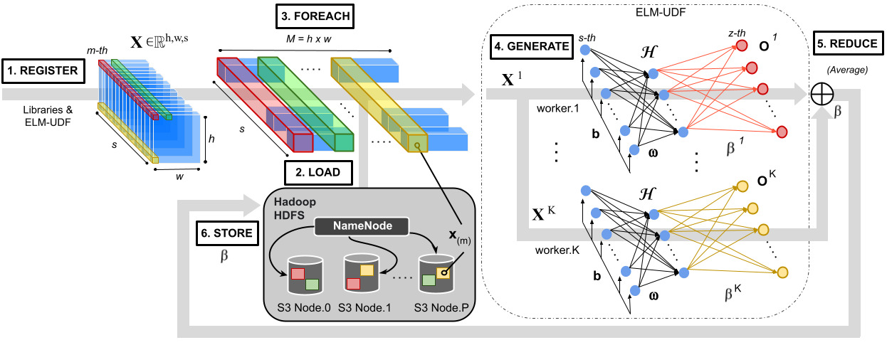

# Cloud Implementation of Extreme Learning Machine for Hyperspectral Image Classification
The Code for "Cloud Implementation of Extreme Learning Machine for Hyperspectral Image Classification". []
```
J. M. Haut, S. Moreno-Álvarez, E. Moreno-Avila, Victor A. Ayma, R. Pastor-Vargas and M. E. Paoletti.
Cloud Implementation of Extreme Learning Machine for Hyperspectral Image Classification
DOI:
July 2023.
```




### Compile Java project
```

```

### Run code

```
#!/bin/bash

pig -f s3://dataelm3/executions/elmtrainIP.pig -param n_hidden=900 -param input="s3://dataelm3/datasetparts_10per/" -param seed=32
pig -f s3://dataelm3/executions/elmtestIP.pig -param n_hidden=900 -param input="s3://dataelm3/TE_BIP_dataset_TPR_.csv" -param seed=32 -param output="s3://dataelm3/test_900N_10per"

```

Reference code of local version: https://github.com/ExtremeLearningMachines/ELM-JAVA/
